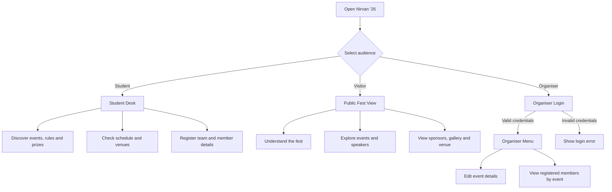
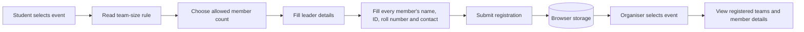
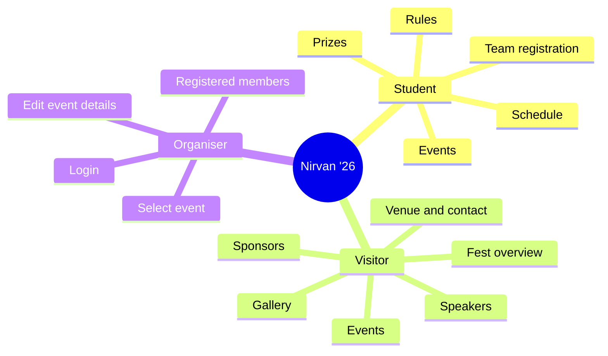

# Nirvan '26

Nirvan '26 is a responsive, framework-free event platform for GEHU's technical fest. The project focuses on three audience experiences: students who want to participate, visitors who want to explore the fest, and organisers who need to manage event information and registrations.

## Project Objective

The objective is to turn a technical-fest website into a useful event experience instead of a static information page. Nirvan '26 brings discovery, participation and event management into one interface:

- Help students find the right event, understand its rules and register their complete team.
- Help visitors understand the festival, explore its programme and find speakers, sponsors and venue details.
- Help organisers present the fest professionally, keep event information updated and review registrations event by event.
- Keep common information easy to scan through clear sections, filters, cards, modals and responsive layouts.

The current project is a frontend prototype. Browser storage demonstrates the registration and organiser workflows without requiring a server or database.

## Project Flow



## Registration and Management Flow



## Information Architecture



## Role-Based Experience

### Student

The Student Desk gives participants a focused way to prepare and register:

- Discover events, categories, rules, team sizes, eligibility and prizes.
- Check the complete event schedule and venue information.
- Register an individual or team for an event.
- Select the event-specific team size.
- Enter each member's name, student ID, roll number and contact number.
- Enter team leader details and submit the complete registration.

### Visitor

The Visitor view is designed for people exploring Nirvan before participating:

- Understand the fest and its purpose.
- Explore all event details without registration access.
- View the programme and schedule.
- Meet the speakers.
- Explore the event gallery and field notes.
- See sponsors, partners and venue/contact information.

### Organiser

The Organiser experience provides a professional management console:

- Access is protected by an organiser login.
- Open a dedicated organiser menu after authentication.
- Edit event name, description, date, time, venue and fee.
- Select an event and view its registered participants separately.
- Review team leader details, team size, student IDs, roll numbers and contacts.
- Persist event updates and registrations in browser storage for this static demo.

## Organiser Login

Use the following demo credentials in the Organiser login:

| Field | Value |
| --- | --- |
| Designation | `Organiser` |
| Email | `admin@123` |
| Password | `123456` |

This is frontend-only demo authentication. The credentials are visible in the client-side JavaScript, so a production deployment should use a secure backend authentication service and database.

## Event Registration

Registration fields are generated from each event's member-size rule:

- Hackathon: 2 to 4 members
- CTF: 1 to 3 members
- E-Sports: 4 to 5 members
- Treasure Hunt: 3 to 5 members
- Workshop: 1 member

Submitted registrations and organiser-edited event data are stored in `localStorage` so the complete flow can be tested without a backend.

## Included Features

### Event Arena

The Event Arena presents every Nirvan activity as a scannable event card. Each card includes the event category, short description, date, team-size rule, registration fee and prize. Category filters make it easy to find BUILD, SECURITY, PLAY, ADVENTURE or LEARN events.

Selecting **View full details** opens a modal with the complete event description, date, time, venue, team requirement, fee, eligibility and event rules. The available action in this modal changes according to the selected role.

### Countdown and Festival Information

The hero section introduces Nirvan '26 with the festival dates, GEHU Dehradun venue, on-campus format and a live countdown to the opening time. The introductory section explains the purpose of the fest and highlights the number of arenas, days and total prize value.

### Schedule

The schedule section lists the festival rhythm in chronological order across both days. Each entry shows the day, time and activity so students and visitors can plan their visit quickly.

### Speakers

The speaker section introduces three professionals from innovation, cybersecurity and product design. Every speaker card includes the person's name, role, organisation, portrait and short biography.

### Gallery and Lightbox

The gallery is divided into event groups such as Hackathon, CTF, E-Sports and Treasure Hunt. Each group contains real event images with captions. Selecting an image opens a full-screen lightbox, which can be closed without leaving the page.

### Sponsors and Partners

The sponsors section establishes the fest's credibility by presenting title sponsors, gold sponsors and community partners in a structured sponsor wall.

### Venue and Contact

The contact section provides the GEHU Dehradun venue, email address and telephone number. Email and phone links can be opened directly from the interface.

### Responsive Design

The layout adapts to desktop and mobile screens. The navigation becomes a mobile menu, event cards and speaker cards switch to a single-column layout, gallery images reflow for smaller screens, and organiser/student panels remain usable on narrow viewports.

### Motion and Accessibility

The interface uses smooth headline reveals, poster entrance motion, subtle poster breathing effects, card hover transitions and toast notifications. The `prefers-reduced-motion` media query reduces or disables animation for users who request less motion.

## Tech Stack

- HTML5
- CSS3
- Vanilla JavaScript
- Browser `localStorage` and `sessionStorage`
- Google Fonts: Space Grotesk and DM Mono

No framework or build dependency is required.

## Run Locally

Open `index.html` directly in a browser, or serve the folder with any static HTTP server:

```powershell
python -m http.server 8000
```

Then open `http://localhost:8000`.

## GitHub Pages Deployment

1. Create a public GitHub repository.
2. Upload all project files, including `index.html`, `style.css`, `script.js`, `assets/` and `posters/`.
3. Open **Settings > Pages**.
4. Select **Deploy from a branch**.
5. Choose `main` and `/ (root)`, then save.
6. Open the generated GitHub Pages URL after the deployment finishes.

## Project Files

- `index.html` - page structure, role menus, forms and modals.
- `style.css` - responsive layout, visual system and animations.
- `script.js` - event data, role switching, registration and organiser console logic.
- `assets/` - event posters, speaker images and gallery media.
- `posters/` - source poster assets.
